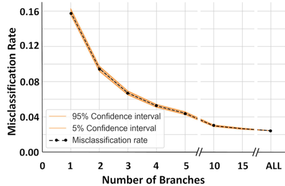

# Combinatorial Classification of Neurons and Glia

This repository contains Python scripts for processing, analyzing, and comparing datasets of neurons and glia based on their branches. The scripts are designed to handle combinatorial classification tasks, generate processed datasets, and compare glial and neuronal data across multiple branches.

## Table of Contents
- Overview
- Scripts
  - glia_combinatorial_classifier.py
  - neuron_combinatorial_classifier.py
  - comparison_glia_neurons.py
- Configuration
- Usage
- Example Directory Structure
- License

---

## Overview

The repository provides tools to:
1. Process glial and neuronal datasets to generate combinatorial classifications.
2. Compare glial and neuronal datasets based on number of branches.
3. Save processed results to CSV files for further analysis.

---

## Scripts

### 1. glia_combinatorial_classifier.py

This script processes glial datasets to generate combinatorial classifications. It performs the following steps:
- Loads the input dataset.
- Generates random samples without replacement of specified sizes.
- Calculates averages for the samples.
- Reshapes and transposes the data.
- Applies a threshold to classify the data.
- Saves the processed data to CSV files.

#### Command:
```bash
python glia_combinatorial_classifier.py <input_csv>
```

#### Example:
```bash
python glia_combinatorial_classifier.py Glia_Data.csv
```

---

### 2. neuron_combinatorial_classifier.py

This script processes neuronal datasets in a similar manner to the glial classifier. It performs the same steps:
- Loads the input dataset.
- Generates random samples without replacement of specified sizes.
- Calculates averages for the samples.
- Reshapes and transposes the data.
- Applies a threshold to classify the data.
- Saves the processed data to CSV files.

#### Command:
```bash
python neuron_combinatorial_classifier.py <input_csv>
```

#### Example:
```bash
python neuron_combinatorial_classifier.py Neuron_Data.csv
```

---

### 3. comparison_glia_neurons.py

This script compares glial and neuronal datasets across multiple branches. It performs the following steps:
1. Loads glial and neuronal datasets specified in a `config.json` file.
2. Concatenates glial and neuronal data for each branch.
3. Calculates the mean, 95th percentile, and 5th percentile for each branch.
4. Saves the results to a CSV file.

#### Command:
```bash
python comparison_glia_neurons.py --config <config_file>
```

#### Example:
```bash
python comparison_glia_neurons.py --config config.json
```

---

## Configuration

The comparison_glia_neurons.py script requires a `config.json` file to specify the input files and output location. Below is an example configuration:

```json
{
    "glia_files": [
        "glia/Glia_Branch-1.csv",
        "glia/Glia_Branch-2.csv",
        "glia/Glia_Branch-3.csv"
    ],
    "neuron_files": [
        "neuron/Neuron_Branch-1.csv",
        "neuron/Neuron_Branch-2.csv",
        "neuron/Neuron_Branch-3.csv"
    ],
    "output_file": "output/comparison_results.csv"
}
```

---

## Usage

### Step 1: Process Glial Data
Run the glia_combinatorial_classifier.py script to process the glial dataset:
```bash
python glia_combinatorial_classifier.py <input_csv>
```

### Step 2: Process Neuronal Data
Run the neuron_combinatorial_classifier.py script to process the neuronal dataset:
```bash
python neuron_combinatorial_classifier.py <input_csv>
```

### Step 3: Compare Glial and Neuronal Data
Create a `config.json` file specifying the paths to the glial and neuronal files and the output file. Then, run the comparison_glia_neurons.py script:
```bash
python comparison_glia_neurons.py --config config.json
```

### Results


---

## Example Directory Structure

```
project/
├── glia/
│   ├── Glia_Branch-1.csv
│   ├── Glia_Branch-2.csv
│   ├── Glia_Branch-3.csv
├── neuron/
│   ├── Neuron_Branch-1.csv
│   ├── Neuron_Branch-2.csv
│   ├── Neuron_Branch-3.csv
├── output/
│   ├── comparison_results.csv
├── config.json
├── glia_combinatorial_classifier.py
├── neuron_combinatorial_classifier.py
├── comparison_glia_neurons.py
```

---

## License

This project is licensed under the MIT License. See the `LICENSE` file for details.

---

## Cite

@article{https://doi.org/10.1002/jnr.25131,
    author = {Akram, Masood A. and Wei, Qi and Ascoli, Giorgio A.},
    title = {Machine learning classification reveals robust morphometric biomarker of glial and neuronal arbors},
    journal = {Journal of Neuroscience Research},
    volume = {101},
    number = {1},
    pages = {112-129},
    keywords = {branch length, cellular identity, K-nearest neighbor, morphology, neuroinformatics, NeuroMorpho.Org, random forest, supervised learning, support vector machine, tree size},
    doi = {https://doi.org/10.1002/jnr.25131},
    url = {https://onlinelibrary.wiley.com/doi/abs/10.1002/jnr.25131},
    year = {2023}
}

---
