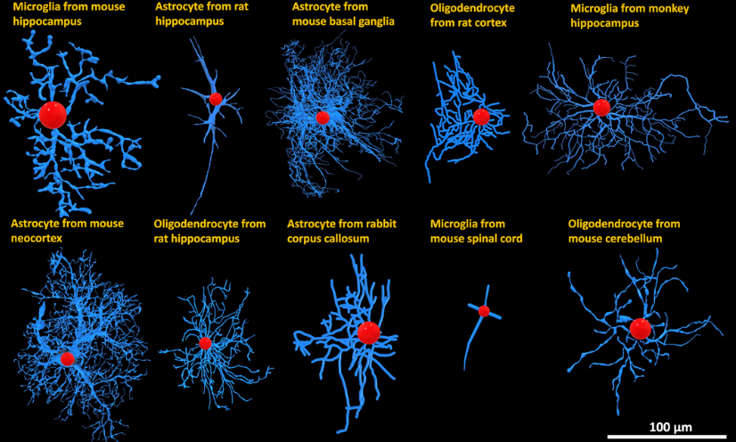
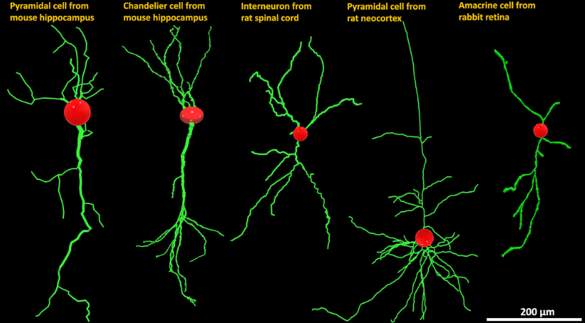
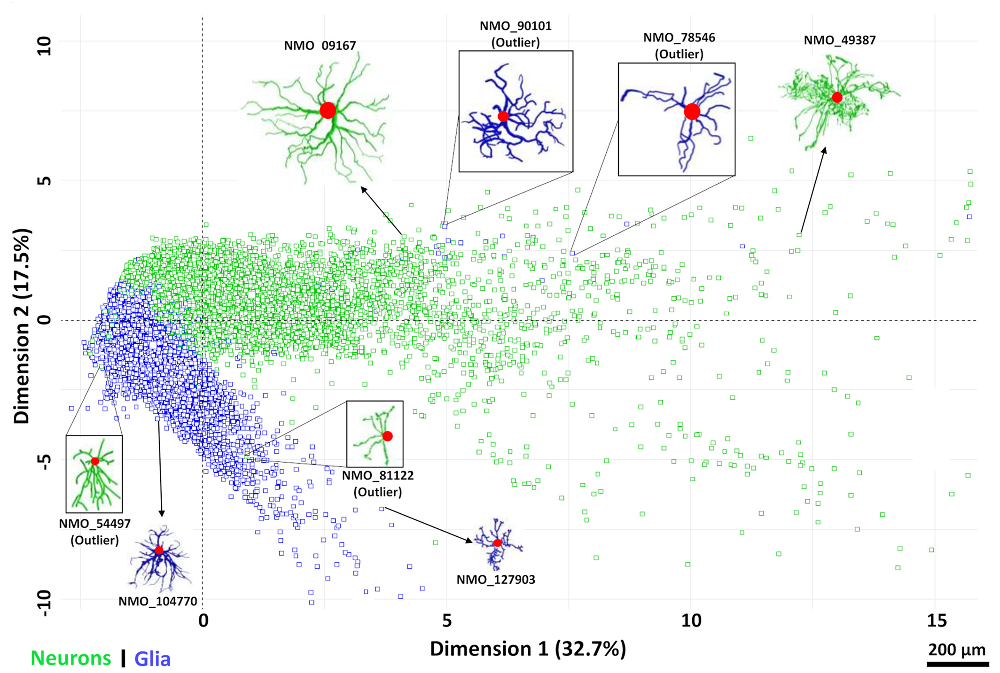

# Machine Learning Classification of Neurons and Glia

This repository contains the code, datasets, and supplementary material for the classification of neurons and glia based on their morphometric features. The project leverages machine learning techniques, optimization, and statistical analyses to distinguish between neurons and glia, providing insights into their structural and functional differences.

  
 
*Figure 1: Representative diversity of morphological reconstructions of glia and neurons from NeuroMorpho.Org with labels indicating animal species, anatomical region, and cell type. Blue: Glial processes; green: Neuronal dendrites; red: Cell bodies.*

---

## Overview

The goal of this project is to classify neurons and glia using their morphometric features and machine learning models. The repository includes:
- [Combinatorial Classification Based On Avg. Branch Euclidean Length (ABEL).](Python_Code/)
- [Machine Learning Classfication.](R_Code/)
- [Morphometric Datasets.](Data/)
- [Supplementary Material.](Supplementary_Material/)

---

## Data Source

The datasets used in this repository were downloaded from [NeuroMorpho.Org](https://www.neuromorpho.org/), the largest public inventory of cellular reconstructions in neuroscience. 

For more information about the data, visit [NeuroMorpho.Org](https://www.neuromorpho.org/).

---

## Repository Structure

### 1. **`Python_Code/`**
This folder contains Python scripts for:
- Combinatorial classification of neurons and glia.
- Data processing and feature extraction.
- Comparison of glial and neuronal datasets across multiple branches.

### 2. **`R_Code/`**
This folder contains R scripts for:
- Training and cross-validating machine learning models (SVM, RF, KNN).
- Dimensionality reduction using PCA.
- Coefficient of determination.
- Linear optimization with PSwarm.

### 3. **`Data/`**
This folder contains datasets used for classification tasks, including:
- Morphometric features of neurons and glia.
- Combined datasets for training and evaluation.

### 4. **`Supplementary_Material/`**
This folder contains additional resources, such as:
- Supporting documentation for the analysis.

---

## Key Features

- **Combinatorial Classification**: Python scripts for ABEL based combinatorial classification.
- **Machine Learning Models**: R scripts for training and evaluating SVM, RF, and KNN models.
- **Dimensionality Reduction**: PCA for visualizing and reducing the complexity of morphometric data.
- **Statistical Analysis**: Correlation of various morphometric features.
- **Optimization**: PSwarm linear optimization based on ABEL and Height.
- **Reproducibility**: All datasets and scripts are provided to ensure reproducibility of the results.

---

## Example Results

 
*Figure 5: PCA biplot of the two-dimensional distribution of neurons and glia relative to the first two principal components (PC1 and PC2).*

---

## How to Use

1. Clone the repository:
   ```bash
   git clone https://github.com/your-username/Classification_Neurons-Glia.git
   cd Classification_Neurons-Glia
   ```

2. Install the required Python and R dependencies:
   - Python: Install dependencies using `requirements.txt` in the `Python_Code/` folder.
     ```bash
     pip install -r Python_Code/requirements.txt
     ```
   - R: Install the necessary R packages as specified in the R scripts.

3. Run the desired scripts for data processing, machine learning, or analysis.

---

## Citation

If you use this repository in your research, please cite the associated paper:

```
@article{your-paper,
  title={Morphological and Machine Learning Classification of Neurons and Glia},
  author={Your Name and Co-authors},
  journal={Journal Name},
  year={2025},
  volume={XX},
  pages={XX-XX},
  doi={DOI}
}
```

---

## License

This project is licensed under the MIT License. See the `LICENSE` file for details.

---
