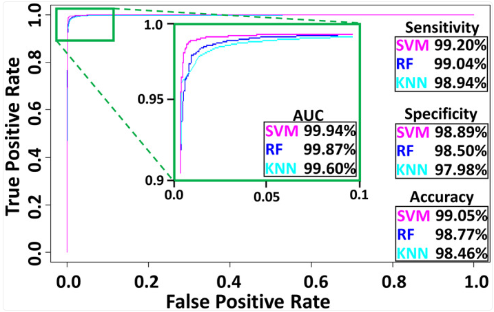

# Morphological Classification of Neurons and Glia

This repository contains R scripts and datasets for analyzing and classifying neurons and glia based on their morphometric features. The scripts implement various machine learning techniques, including Support Vector Machines (SVM), Random Forest (RF), and k-Nearest Neighbors (KNN), dimensionality reduction methods like Principal Component Analysis (PCA), and PSwarm Optimization.

## Table of Contents
- Overview
- Repository Structure
- Scripts
  - Coefficient_of_Determination.R
  - PCA.R
  - SVM_CrossValidation.R
  - KNN_CrossValidation.R  
  - RF_CrossValidation.R 
  - PSwarm_Optimization
- Results
- Datasets
- Usage
- Cite

---

## Overview

The goal of this repository is to classify neurons and glia based on their morphometric features using machine learning techniques. The repository includes scripts for:
- Relationship of morphometric features using coefficient of determination.
- Dimensionality reduction using PCA.
- Machine learning classification with cross validation (SVM, RF, KNN).
- Optimization of hyperparameters using Particle Swarm Optimization (PSO).

---

## Repository Structure

```
project/
├── PSwarm_Optimization/         # Directory for Particle Swarm Optimization scripts
├── Coefficient_of_Determination.R  # Script for calculating R-squared values
├── Data_Classification.csv      # Dataset for classification tasks
├── Glia_Morphometrics.csv       # Morphometric data for glia
├── Neuron_Morphometrics.csv     # Morphometric data for neurons
├── New_Data_Full.csv            # Combined dataset for neurons and glia
├── PCA.R                        # Script for Principal Component Analysis
├── RF_CrossValidation.R         # Random Forest cross-validation script
├── KNN_CrossValidation.R        # k-Nearest Neighbors cross-validation script
├── SVM_CrossValidation.R        # Support Vector Machine cross-validation script
└── README.md                    # Documentation for the repository
```

---

## Scripts

### 1. `Coefficient_of_Determination.R`
This script calculates the coefficient of determination (R-squared) for regression models.

#### Key Features:
- Evaluates the goodness of fit for regression models.
- Outputs R-squared values for the predictions.

#### Usage:
```r
source("Coefficient_of_Determination.R")
```

---

### 2. `PCA.R`
This script performs Principal Component Analysis (PCA) on the morphometric datasets to reduce dimensionality and visualize the data.

#### Key Features:
- Reduces the dataset to a specified number of principal components.
- Generates plots for visualizing the principal components.

#### Usage:
```r
source("PCA.R")
```

---

### 3. `SVM_CrossValidation.R`
This script implements Support Vector Machine (SVM) classification with cross-validation. It evaluates the performance of the SVM model on the morphometric datasets.

#### Key Features:
- Performs k-fold cross-validation.
- Outputs classification accuracy and other performance metrics.

#### Usage:
```r
source("SVM_CrossValidation.R")
```

---

### 4. `KNN_CrossValidation.R`
This script implements k-Nearest Neighbors (KNN) classification with cross-validation. It evaluates the performance of the KNN model on the morphometric datasets.

#### Key Features:
- Performs k-fold cross-validation.
- Allows tuning of the number of neighbors (`k`).

#### Usage:
```r
source("KNN_CrossValidation.R")
```

---

### 5. `RF_CrossValidation.R`
This script implements Random Forest (RF) classification with cross-validation. It evaluates the performance of the RF model on the morphometric datasets.

#### Key Features:
- Performs k-fold cross-validation.
- Outputs feature importance and classification accuracy.

#### Usage:
```r
source("RF_CrossValidation.R")
```

---

### 6. `PSwarm_Optimization/`
This directory contains scripts for linear optimization using PSwarm. 
These scripts are used to optimize glia and neuronal separation using height and length.

---

### Results


---

## Datasets

### 1. `Data_Classification.csv`
A dataset containing morphometric features for classification tasks.

### 2. `Glia_Morphometrics.csv`
Morphometric data specific to glial cells.

### 3. `Neuron_Morphometrics.csv`
Morphometric data specific to neurons.

### 4. `New_Data_Full.csv`
A combined dataset containing morphometric features for both neurons and glia.

---

## Usage

1. Clone the repository:
   ```bash
   git clone https://github.com/your-username/Classification_Neurons-Glia.git
   cd Classification_Neurons-Glia
   ```

2. Open the R scripts in RStudio or your preferred R environment.

3. Run the desired script using:
   ```r
   source("script_name.R")
   ```

4. Ensure the required datasets are in the same directory as the scripts.

---

## Cite

Please cite the following paper if you used this tool in any publication:

```BibTex

@article{https://doi.org/10.1002/jnr.25131,
  author = {Akram, Masood A. and Wei, Qi and Ascoli, Giorgio A.},
  doi = {https://doi.org/10.1002/jnr.25131},
  journal = {Journal of Neuroscience Research},
  number = {1},
  pages = {112--129},
  title = {{Machine learning classification reveals robust morphometric biomarker of glial and neuronal arbors}},
  volume = {101},
  year = {2023}
}

```

---
